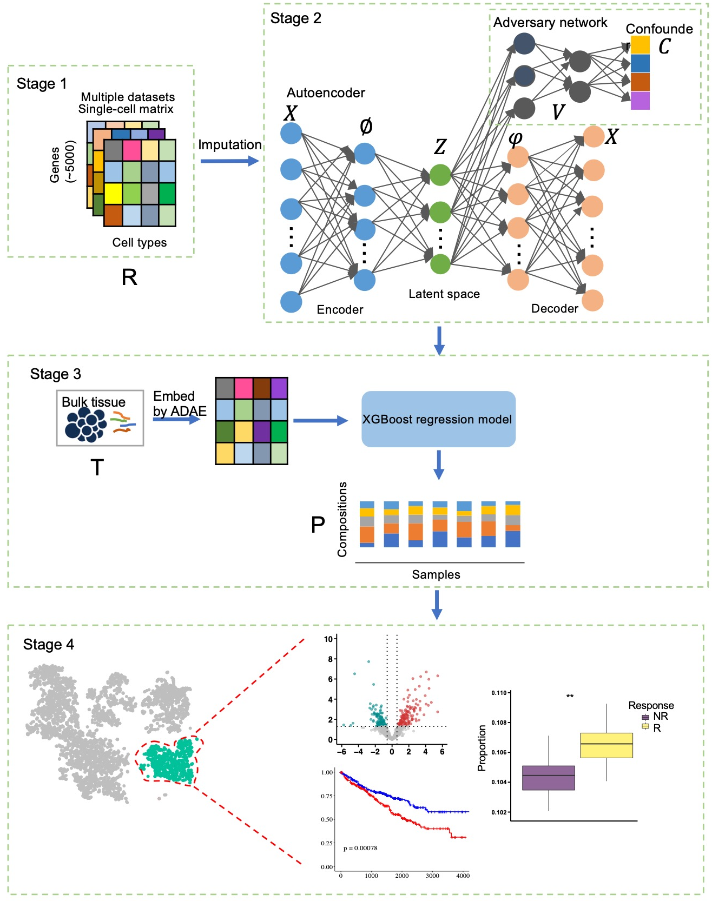

# scPER
## Introduction
scPER, which stands for Estimating Cell Proportions using single-cell RNA-seq Reference, is a novel computational approach that combines an adversarial autoencoder with extreme gradient boosting. It can robustly estimate the relative compositions of cells and their subtypes within the tumor microenvironment and identify phenotype-associated subclusters. By integrating scRNA-seq datasets from various tumors, scPER constructs comprehensive reference panels encompassing all possible tumor cell types and disentangles confounding factors from true signals within the latent space of the adversarial autoencoder model.

## Quick Start

### Preprocess the scRNA-seq data

Rscript preprocess_data.R /example/example_matrix_200_cells_ref.csv /example/Bulk_simulation_100_all_genes.csv

### Run adversarial autoencoder for scRNA-seq data and bulk samples

python -u main.py /results/reference_top5k_imputation.csv  /data/example_label_200_cells_ref.csv  /results/bulk_5k_genes_matched.csv

### Estimate the cell proportions in the bulk samples

Rscript XGBoost.R /results/ADAE_100_latents.tsv /results/bulk_100_latents.tsv /data/example_label_200_cells_ref.csv

### Identify the phenotype-associated cell populations
